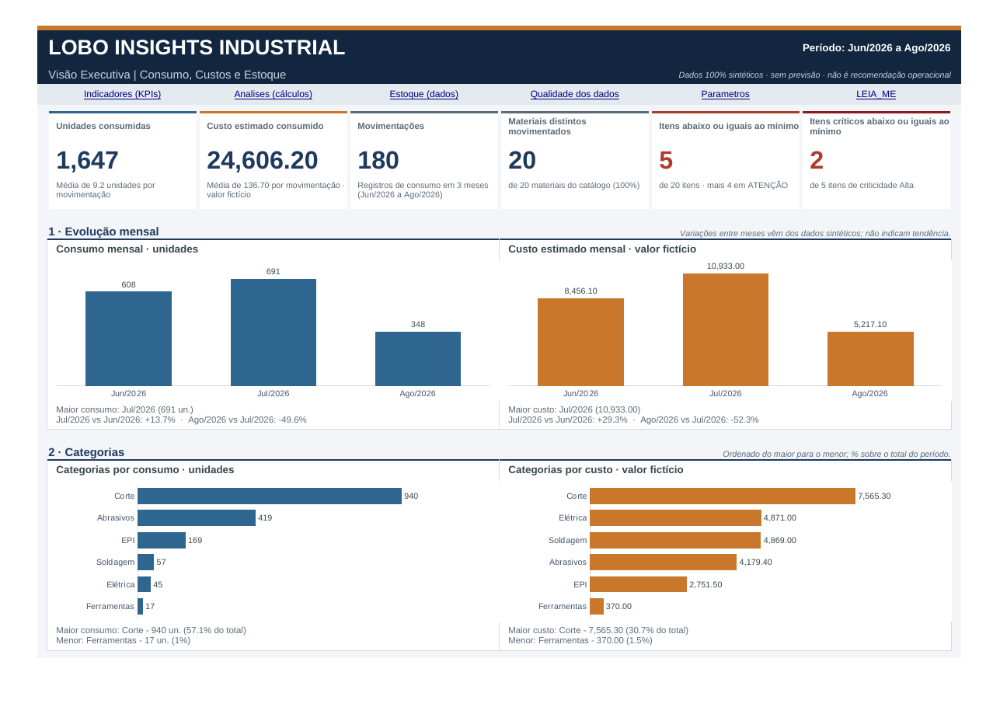
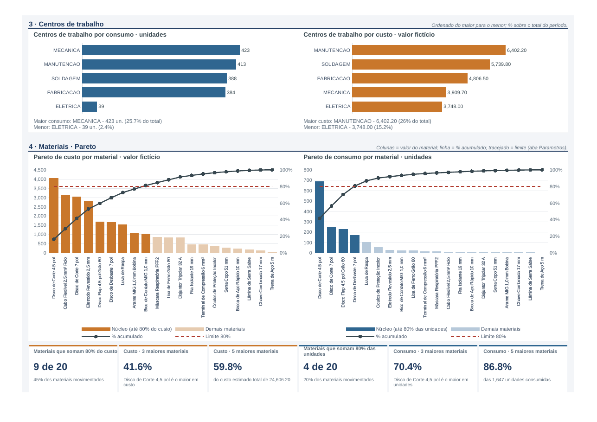
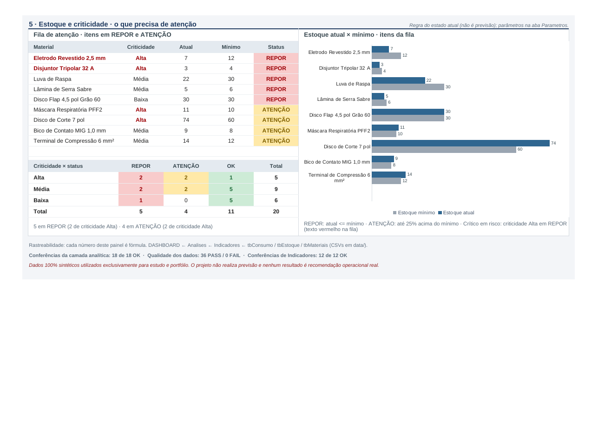

# 🐺 Lobo Insights Industrial

### Projeto Lobo 1 — Industrial Executive Intelligence
### Lobo Project 1 — Industrial Executive Intelligence

[](#)
[](#)
[](https://github.com/lhvisualbr/projeto-lobo-1-lobo-insights-industrial/actions/workflows/ci.yml)
[](#)
[](#)

> **PT-BR:** Motor de Inteligência Executiva Industrial para transformar dados de estoque e consumo em sinais explicáveis, priorizados e rastreáveis.
>
> **EN:** Industrial Executive Intelligence Engine designed to transform inventory and consumption data into explainable, prioritized and traceable signals.

---

# 🇧🇷 Português

## Visão geral

O **Lobo Insights Industrial** é um projeto autoral de portfólio voltado à análise e inteligência aplicada a operações industriais.

A versão **V0.3.0 — Executive Intelligence Foundation** introduz um motor determinístico capaz de transformar dados industriais sintéticos em sinais estruturados relacionados a:

- estoque;
- consumo;
- custos;
- cobertura;
- criticidade;
- lead time;
- risco de reposição;
- concentração e exposição por fornecedor.

O objetivo não é utilizar IA generativa para inventar conclusões.

O projeto prioriza:

**dados → métricas → regras → evidências → sinais → scoring → prioridade → recomendação**

Cada resultado pode ser rastreado até os dados e regras que o originaram.

---

## Problema

Dados industriais podem existir em planilhas e registros separados sem necessariamente estarem prontos para apoiar decisões.

O projeto busca responder perguntas como:

- Quais materiais precisam de atenção primeiro?
- Onde existe risco de reposição?
- Quais itens concentram maior impacto financeiro?
- Quais materiais apresentaram mudança relevante de consumo?
- Existe concentração excessiva em determinado fornecedor?
- Por que determinado item foi classificado como prioritário?

---

## Arquitetura

```text
Dados sintéticos
      ↓
Features analíticas
      ↓
Regras determinísticas
      ↓
Sinais estruturados
      ↓
Scoring
      ↓
Priorização
      ↓
Recomendações
      ↓
Indicadores
      ↓
Resumo executivo
      ↓
JSON / Markdown / TXT
```

Estrutura principal:

```text
src/
└── intelligence/
    ├── models.py
    ├── features.py
    ├── rules.py
    ├── consumption_rules.py
    ├── cost_rules.py
    ├── lead_time_rules.py
    ├── supplier_rules.py
    ├── scoring.py
    ├── engine.py
    └── report.py
```

---

## Resultados da base de demonstração

A base sintética atual contém:

- **20 materiais**
- **180 movimentações**
- **1.647 unidades consumidas**
- **R$ 24.606,20** de custo estimado de consumo
- período de **01/06/2026 a 31/08/2026**

Resultado do motor:

- **42 sinais executivos**
- **15 materiais** com pelo menos um sinal
- **3 fornecedores** com pelo menos um sinal

---

# 🚀 Quick Start

O projeto pode ser executado localmente seguindo apenas as etapas abaixo.

## 1. Pré-requisitos

Obrigatórios:

- Git
- Python **3.12**

Para executar a validação completa incluindo verificações relacionadas ao Excel, recomenda-se também:

- LibreOffice **24.2 ou superior**

O LibreOffice não é necessário para executar apenas o motor V0.3.0 e gerar os relatórios executivos.

---

## 2. Clonar o repositório

```bash
git clone https://github.com/lhvisualbr/projeto-lobo-1-lobo-insights-industrial.git
cd projeto-lobo-1-lobo-insights-industrial
```

---

## 3. Criar ambiente virtual

### Windows PowerShell

```powershell
python -m venv .venv
.\.venv\Scripts\Activate.ps1
```

### Linux / macOS

```bash
python3 -m venv .venv
source .venv/bin/activate
```

---

## 4. Instalar dependências

```bash
python -m pip install --upgrade pip
pip install -r requirements.txt
```

Principais dependências:

- pandas
- openpyxl
- lxml

---

# ▶️ Como executar o projeto

Para executar o **Executive Intelligence Engine** e gerar os relatórios:

```bash
python scripts/gerar_relatorio_v0_3.py
```

O script:

1. carrega os dados sintéticos;
2. executa o motor de inteligência;
3. calcula features;
4. aplica regras determinísticas;
5. gera sinais;
6. calcula scoring;
7. prioriza resultados;
8. gera recomendações;
9. produz os relatórios.

Ao final, o terminal apresenta:

- resumo executivo;
- indicadores;
- top prioridades;
- arquivos gerados.

---

# 👀 Como visualizar os resultados

A V0.3.0 não possui aplicação web.

Os resultados são disponibilizados em:

```text
reports/v0_3/
```

Arquivos gerados:

```text
executive_intelligence_report.json
executive_intelligence_report.md
executive_intelligence_report.txt
```

Para uma leitura rápida, abra:

```text
reports/v0_3/executive_intelligence_report.md
```

O JSON contém a estrutura completa para integração futura com outros sistemas.

---

# 📊 Dashboard histórico

O projeto também preserva a camada analítica desenvolvida anteriormente em Excel.

Arquivo principal:

```text
excel/Projeto_Lobo_1_Lobo_Insights_Industrial_V0_2_1.xlsx
```

Ela inclui indicadores, análises e dashboard executivo.

### Prévia







> O dashboard pertence à camada histórica V0.2/V0.2.1.
> A V0.3.0 adiciona o Executive Intelligence Engine sem substituir essa baseline.

---

# ✅ Como validar o projeto

Execute:

```bash
python scripts/executar_testes_v0_3.py
```

Resultado validado da V0.3.0:

```text
Baseline histórica: PASS
Qualidade dos dados: 36/36 PASS

Testes V0.3.0:
194 executados
194 PASS
0 FAIL/ERROR
0 SKIP

RESULTADO FINAL: PASS
```

A suíte verifica, entre outros pontos:

- qualidade dos dados;
- modelos de domínio;
- features analíticas;
- regras de estoque;
- regras de consumo;
- regras de custos;
- risco de reposição;
- fornecedores;
- scoring;
- ordenação;
- determinismo;
- não mutação dos dados de entrada;
- geração de relatórios;
- portabilidade regional;
- preservação da baseline histórica.

---

# 🔄 Integração Contínua

O projeto utiliza **GitHub Actions**.

Workflow:

```text
.github/workflows/ci.yml
```

A cada push na `main` ou branch de desenvolvimento compatível, o CI:

1. prepara Python 3.12;
2. instala LibreOffice;
3. instala as dependências;
4. executa a suíte oficial V0.3.0.

O status atual pode ser acompanhado pelo badge **CI** no topo deste README.

---

# 🧪 Reprodutibilidade

O projeto foi estruturado para permitir que um terceiro possa:

```text
clonar
→ instalar dependências
→ executar o motor
→ gerar relatórios
→ visualizar resultados
→ executar testes
```

sem depender do ambiente original de desenvolvimento.

Os dados utilizados no repositório são sintéticos e reproduzíveis.

---

# 📁 Estrutura resumida

```text
.
├── .github/
│   └── workflows/
├── data/
├── docs/
├── excel/
├── images/
├── reports/
│   └── v0_3/
├── scripts/
├── src/
│   └── intelligence/
├── tests/
├── CHANGELOG.md
├── README.md
├── requirements.txt
├── SHA256SUMS.txt
└── RELEASE_SHA256SUMS.txt
```

---

# 🔎 Princípio de explicabilidade

O projeto segue a regra:

> **Inteligência verificável antes de inteligência generativa.**

Um sinal deve possuir evidências suficientes para explicar:

- o que ocorreu;
- qual métrica foi utilizada;
- qual regra foi acionada;
- qual severidade foi atribuída;
- como a prioridade foi calculada;
- qual recomendação foi produzida.

---

# ⚠️ Limitações atuais

A V0.3.0 não inclui:

- aplicação web;
- API;
- banco de dados;
- Power BI integrado à V0.3.0;
- n8n;
- SAP;
- ERP;
- UiPath;
- Azure DevOps;
- decisões operacionais automáticas;
- previsão de demanda;
- dependência de IA generativa externa.

Esses itens não devem ser considerados implementados.

---

# 🔐 Dados e privacidade

Todos os dados utilizados no projeto são **100% sintéticos**.

Não são utilizados dados reais de:

- empresas;
- colaboradores;
- clientes;
- fornecedores reais;
- contratos;
- processos internos;
- operações confidenciais.

O projeto existe exclusivamente para estudo, desenvolvimento técnico e portfólio.

---

# © Autoria e uso

Este é um **projeto autoral de portfólio**.

O código-fonte é disponibilizado publicamente para:

- demonstração técnica;
- estudo;
- avaliação por recrutadores;
- avaliação por gestores e desenvolvedores.

A publicação pública do repositório **não representa concessão automática de licença permissiva para uso comercial, redistribuição ou apropriação do projeto**.

Nenhuma licença MIT, Apache, GPL ou equivalente foi concedida neste repositório.

---

# 📦 Release oficial

Release:

```text
v0.3.0
```

Pacote oficial:

```text
Projeto_Lobo_1_Lobo_Insights_Industrial_V0_3_0.zip
```

SHA-256:

```text
EF49131D9725759EA13C983766DF7717F200E903F19665E048B53102D1D0541D
```

Auditoria do pacote:

```text
83 arquivos rastreados
83 arquivos empacotados
0 arquivos ausentes
0 arquivos extras
0 entradas corrompidas

ZIP AUDIT: PASS
```

> A tag `v0.3.0` preserva a release oficial auditada.
> Melhorias posteriores de documentação na branch `main` não alteram o pacote oficial congelado.

---

# 🇺🇸 English

## Overview

**Lobo Insights Industrial** is an original portfolio project focused on industrial analytics and executive intelligence.

Version **V0.3.0 — Executive Intelligence Foundation** introduces a deterministic engine designed to transform synthetic industrial data into structured, explainable and prioritized signals involving:

- inventory;
- consumption;
- costs;
- coverage;
- criticality;
- lead time;
- replenishment risk;
- supplier concentration and exposure.

The project follows the principle:

> **Verifiable intelligence before generative intelligence.**

The engine does not depend on an external generative AI model to determine operational risk.

---

## Architecture

```text
Synthetic data
      ↓
Analytical features
      ↓
Deterministic rules
      ↓
Structured signals
      ↓
Scoring
      ↓
Prioritization
      ↓
Recommendations
      ↓
Indicators
      ↓
Executive summary
      ↓
JSON / Markdown / TXT
```

---

## Demo dataset

The synthetic dataset contains:

- **20 materials**
- **180 movements**
- **1,647 consumed units**
- **BRL 24,606.20** estimated consumption cost
- period from **2026-06-01 to 2026-08-31**

Engine results:

- **42 executive signals**
- **15 materials** with at least one signal
- **3 suppliers** with at least one signal

---

# 🚀 Quick Start

## Requirements

Required:

- Git
- Python **3.12**

Recommended for the complete validation suite:

- LibreOffice **24.2 or newer**

LibreOffice is not required only to run the V0.3.0 intelligence engine and generate reports.

---

## Clone

```bash
git clone https://github.com/lhvisualbr/projeto-lobo-1-lobo-insights-industrial.git
cd projeto-lobo-1-lobo-insights-industrial
```

---

## Create a virtual environment

### Windows PowerShell

```powershell
python -m venv .venv
.\.venv\Scripts\Activate.ps1
```

### Linux / macOS

```bash
python3 -m venv .venv
source .venv/bin/activate
```

---

## Install dependencies

```bash
python -m pip install --upgrade pip
pip install -r requirements.txt
```

---

# ▶️ Run the project

Execute:

```bash
python scripts/gerar_relatorio_v0_3.py
```

The engine will process the synthetic data and generate the executive reports.

Outputs:

```text
reports/v0_3/executive_intelligence_report.json
reports/v0_3/executive_intelligence_report.md
reports/v0_3/executive_intelligence_report.txt
```

For a quick human-readable result, open:

```text
reports/v0_3/executive_intelligence_report.md
```

---

# ✅ Run validation

```bash
python scripts/executar_testes_v0_3.py
```

Validated result:

```text
Historical baseline: PASS
Data quality: 36/36 PASS

V0.3.0 tests:
194 executed
194 PASS
0 FAIL/ERROR
0 SKIP

FINAL RESULT: PASS
```

---

# 🔄 Continuous Integration

GitHub Actions workflow:

```text
.github/workflows/ci.yml
```

The CI environment:

1. sets up Python 3.12;
2. installs LibreOffice;
3. installs project dependencies;
4. runs the official V0.3.0 validation suite.

The current CI status is displayed at the top of this README.

---

# 👀 Visualization

V0.3.0 is not a web application.

Results can be inspected through:

- Markdown report;
- JSON report;
- TXT report.

The repository also preserves the historical Excel dashboard:

```text
excel/Projeto_Lobo_1_Lobo_Insights_Industrial_V0_2_1.xlsx
```

Dashboard screenshots are available in:

```text
images/
```

---

# ⚠️ Current limitations

V0.3.0 does not include:

- web application;
- API;
- database;
- integrated Power BI layer;
- n8n;
- SAP;
- ERP integration;
- UiPath;
- Azure DevOps;
- automatic operational decisions;
- demand forecasting;
- external generative AI dependency.

These capabilities must not be presented as implemented.

---

# 🔐 Data and privacy

All project data is **100% synthetic**.

No real company, employee, customer, supplier, contract or confidential operational data is used.

---

# © Authorship and usage

This is an **original portfolio project**.

The source code is publicly available for:

- technical demonstration;
- study;
- recruiter evaluation;
- engineering review.

Public availability does **not automatically grant a permissive license for commercial use, redistribution or appropriation of the project**.

No MIT, Apache, GPL or equivalent permissive license has been granted by this repository.

---

# 📦 Official release

Release:

```text
v0.3.0
```

Official package:

```text
Projeto_Lobo_1_Lobo_Insights_Industrial_V0_3_0.zip
```

SHA-256:

```text
EF49131D9725759EA13C983766DF7717F200E903F19665E048B53102D1D0541D
```

Package audit:

```text
83 tracked files
83 packaged files
0 missing files
0 extra files
0 corrupt entries

ZIP AUDIT: PASS
```

The `v0.3.0` tag preserves the audited official release.

Documentation improvements made later on the `main` branch do not modify the frozen release package.
